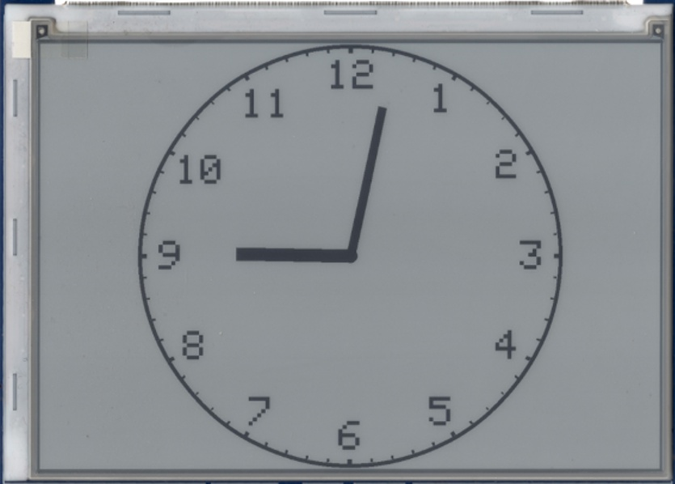
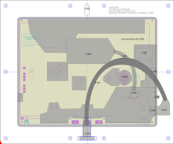
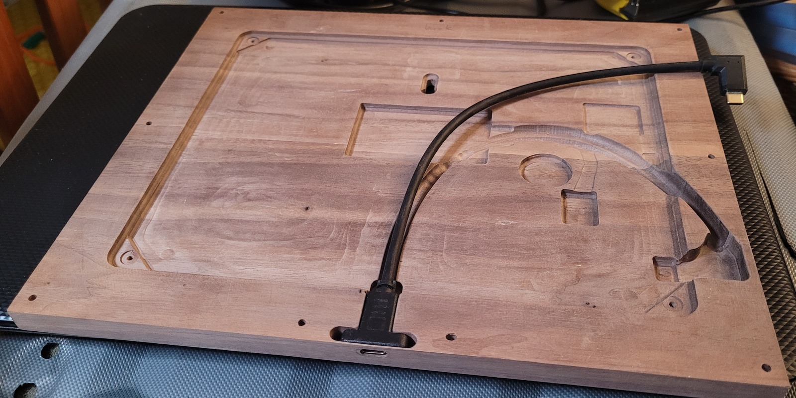

This is an arduino project to display an "analog" clockface on an electrophoretic screen, along with a mechanical design (svg) to use a handheld cnc router to mill out the insides of a block of wood to make a case for the clock.

